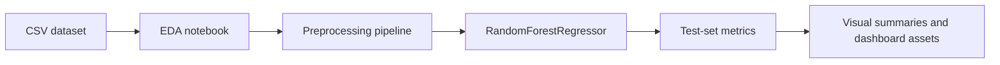

# Food Delivery Time Prediction

A machine learning project that predicts food delivery time in minutes from distance, weather, traffic, courier, vehicle, and preparation-time features.

## Problem

Delivery platforms need realistic delivery-time estimates for customer expectations, courier planning, and operational monitoring. A simple average delivery time hides meaningful differences caused by distance, traffic, weather, vehicle type, restaurant preparation time, and courier experience.

This project builds a reproducible regression workflow that predicts delivery time and reports error in minutes.

## Dataset / Source

The dataset is [Food_Delivery_Times.csv](Food_Delivery_Times.csv), included in the repository.

| Field | Meaning |
|---|---|
| `Order_ID` | Unique order identifier, dropped before modeling |
| `Distance_km` | Delivery distance |
| `Weather` | Weather condition during delivery |
| `Traffic_Level` | Traffic level |
| `Time_of_Day` | Morning, afternoon, evening, or night |
| `Vehicle_Type` | Courier vehicle type |
| `Preparation_Time_min` | Restaurant preparation time |
| `Courier_Experience_yrs` | Courier experience in years |
| `Delivery_Time_min` | Target variable |

## Tech Stack

- Python
- pandas
- NumPy
- scikit-learn
- Matplotlib / Seaborn
- Jupyter Notebook

## Architecture / Workflow


```mermaid
flowchart LR
    A[CSV dataset] --> B[EDA notebook]
    B --> C[Preprocessing pipeline]
    C --> D[RandomForestRegressor]
    D --> E[Test-set metrics]
    E --> F[Visual summaries and dashboard assets]
```

The reproducible training script uses a scikit-learn `Pipeline` with:

- Median imputation for numeric missing values
- Most-frequent imputation for categorical missing values
- One-hot encoding for categorical features
- `RandomForestRegressor` with 200 trees

## Project Files

| File | Purpose |
|---|---|
| [deliverytines.ipynb](deliverytines.ipynb) | Exploratory notebook with charts, preprocessing, training, and evaluation |
| [train_model.py](train_model.py) | Reproducible training and evaluation script |
| [requirements.txt](requirements.txt) | Python dependencies |
| [assets/](assets/) | Model and business-impact visuals |

## Results / Metrics

The script reports test-set regression metrics.

```text
Food Delivery Time Model
========================
Rows: 1,000
Target: Delivery_Time_min
MAE:  6.72 minutes
RMSE: 9.56 minutes
R2:   0.796
```

MAE is the most interpretable metric here: the model is off by about 6 to 7 minutes on average.

Supporting visuals include:

- Model comparison
- Feature importance
- Prediction accuracy
- Error heatmap
- Business impact summary

## How to Run

1. Clone the repository.

```bash
git clone https://github.com/LukeOpany/food-delivery-timelines.git
cd food-delivery-timelines
```

2. Create and activate a virtual environment.

```bash
python3 -m venv .venv
source .venv/bin/activate
```

3. Install dependencies.

```bash
pip install -r requirements.txt
```

4. Run the reproducible training script.

```bash
python train_model.py
```

5. Open the notebook for the full walkthrough.

```bash
jupyter notebook deliverytines.ipynb
```

## What I Learned / Production Improvements

This project demonstrates:

- Building an end-to-end regression workflow with mixed numeric and categorical features.
- Using scikit-learn pipelines to keep preprocessing and modeling reproducible.
- Evaluating model error in business-friendly units: minutes.
- Separating exploratory analysis from a clean training script.

Production next steps:

- Add a baseline model comparison directly in `train_model.py`.
- Save the fitted pipeline with `joblib` for reuse.
- Add tests for preprocessing behavior and required columns.
- Create a small FastAPI endpoint for inference.
- Track model performance by traffic level, weather, and time of day.
